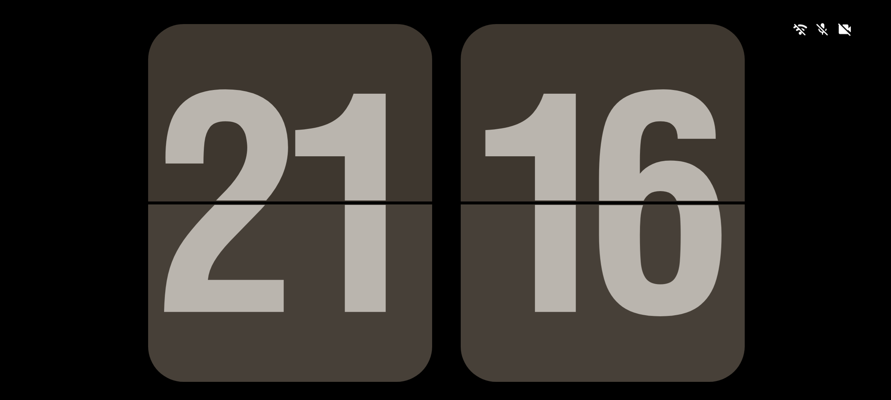
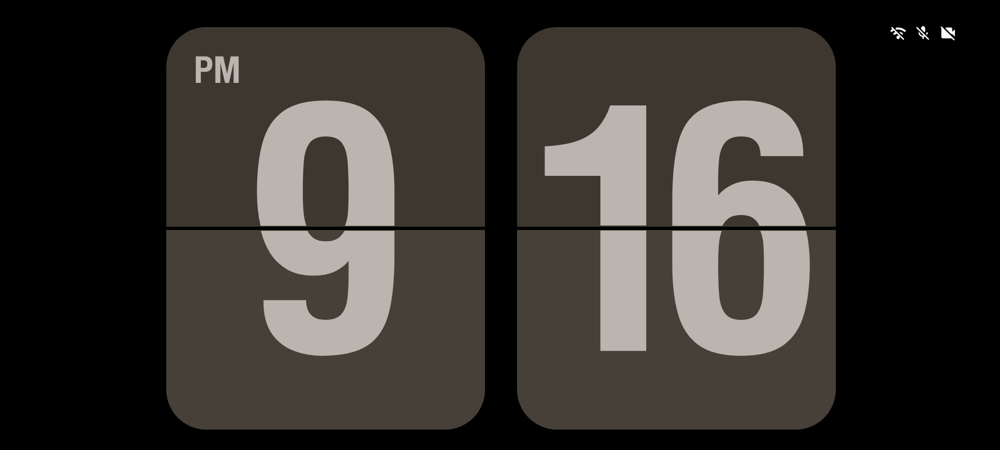
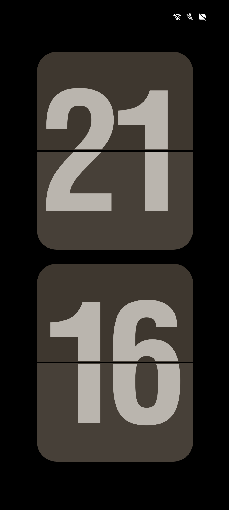
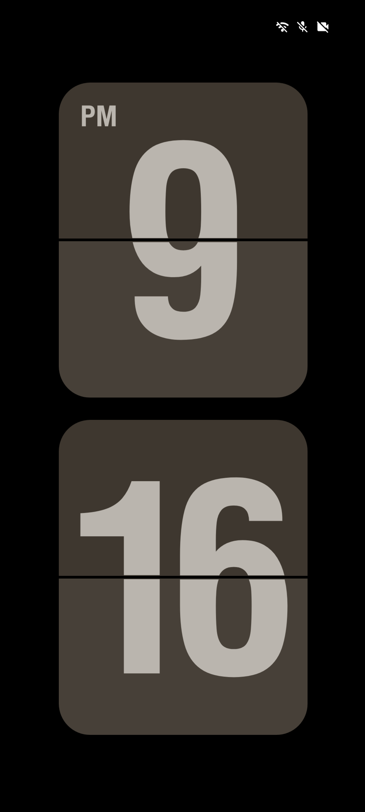
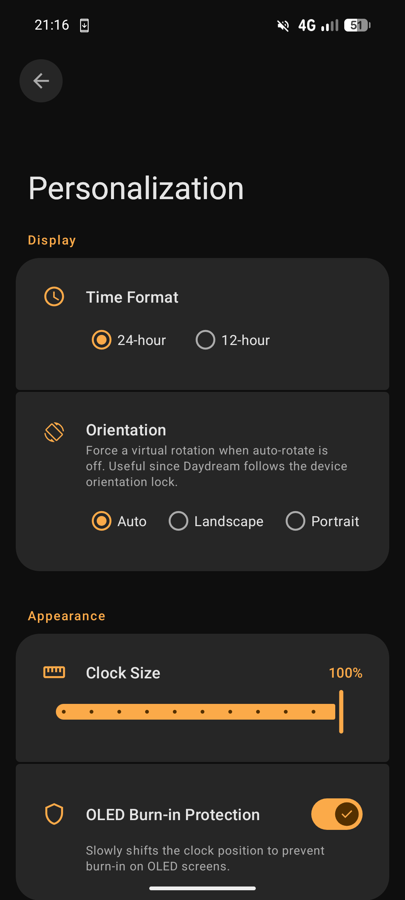

<h2 align="center">DreamFlipClock</h2>
<p align="center">A flip clock screensaver for Android</p>
<p align="center">
    <a href="#about">About</a> •
    <a href="#features">Features</a> •
    <a href="#screenshots">Screenshots</a> •
    <a href="#use-cases">Use Cases</a> •
    <a href="#installation">Installation</a> •
    <a href="#usage">Usage</a> •
    <a href="#license">License</a>
</p>

## About

DreamFlipClock turns your Android device into a minimalist flip clock when idle, using the system Daydream / screensaver API.

## Features

- **Authentic flip animation**: True 3D card flip.
- **24h / 12h format**: Native AM/PM display.
- **Forced orientation**: Virtual rotation to bypass the system orientation lock that Daydream inherits.
- **Adjustable clock size**.
- **OLED burn-in protection**: Discrete pixel shifting to prevent screen burn-in.
- **System-wide overlay (optional)**: Forces a brightness lower than the system minimum and dims status bar icons (alarm, battery).
- **Schedule**: Automatically enables the overlay only between two configured times.
- **Material 3 Expressive** with dynamic colors (Material You). The clock picks up the system accent.
- **No analytics, no telemetry, no ads.**

## Screenshots

<p align="center">
    
    &nbsp;&nbsp;&nbsp;
    
</p>

<p align="center">
    
    &nbsp;&nbsp;&nbsp;
    
</p>

<p align="center">
    
</p>

## Use Cases

- **Bedside clock**: Plug your phone in, let it sleep, and watch a clean flip clock take over the screen.
- **OLED-friendly always-on**: The aggressive overlay brings the screen brightness well below the system minimum so you can leave it on all night without ruining your eyes (or your panel).
- **Charging dock display**: Turn an old phone into a dedicated desk clock.

## Installation

Grab the latest APK from the [releases page](https://github.com/gaetanlhf/DreamFlipClock/releases) or build from source.

### Build from source

Needs JDK 21+ and the Android SDK (compileSdk 36, minSdk 30).

```bash
git clone https://github.com/gaetanlhf/DreamFlipClock.git
cd DreamFlipClock
./gradlew assembleRelease
```

The APK lands in `app/build/outputs/apk/release/`.

## Usage

1. Install the APK
2. Go to **Settings → Display → Screen saver**, select **DreamFlipClock**, then tap the gear icon to open the personalization screen
3. Configure time format, orientation, clock size, OLED protection
4. (Optional) Enable the **Full-Screen Overlay** to force a lower brightness — this requires enabling the DreamFlipClock accessibility service in **Settings → Accessibility**
5. (Optional) Set a **Schedule** to only activate the overlay at night
6. Set when the screensaver starts in **Settings → Display → Screen saver → When to start** (e.g. *While charging*)

The clock will appear automatically once your phone is plugged in and the screen times out.

## License

This program is free software: you can redistribute it and/or modify it under the terms of the GNU General Public License as published by the Free Software Foundation, either version 3 of the License, or (at your option) any later version.

This program is distributed in the hope that it will be useful, but WITHOUT ANY WARRANTY; without even the implied warranty of MERCHANTABILITY or FITNESS FOR A PARTICULAR PURPOSE. See the GNU General Public License for more details.

You should have received a copy of the GNU General Public License along with this program. If not, see http://www.gnu.org/licenses/.
